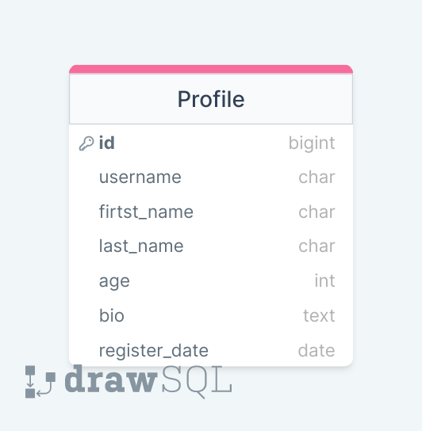

## Assignment 1

### Beklenenler
<ul>
<li>Django projenizi oluşturunuz ve bir userprofile app i ekleyiniz.</li>
<li>App içerisinde diagramı verilen modeli oluşturunuz.</li>
<li>Modele shell terminali üzerinden erişim sağlayıp fieldlara uygun 5 adet veri giriniz.</li>
<li>Bu verileri orm sorgularıyla listeleyiniz.Bu listelemeyi yaparken sizlerden beklenenler şu şekilde:
<ul>
    <li>Tüm Profile bilgilerini sorgulamanız.</li>
    <li>Id bilgisine göre tek tek sorgulama yapmanız(Burada tek bir id ile sorgulamanız yeterli)</li>
    <li>Girdiğiniz bilgilere göre herhangi bir last_name bilgisini seçip last_name bilgisi aynı olan profile bilgilerini sorgulamanız.Örneğin; last_name i "harold" olan profile bilgileri</li>

</ul>
</li>
<li>Shell komutlarınızın history.txt sini veya ekran görüntüsünü threadde paylaşınız.</li>
<li>İsteğe bağlı olarak oluşturduğunuz projeyi githuba pushlayıp yaptığınız işlemlerle alakalı readme.md hazırlayıp sergileyebilirsiniz</li>
</ul>

 