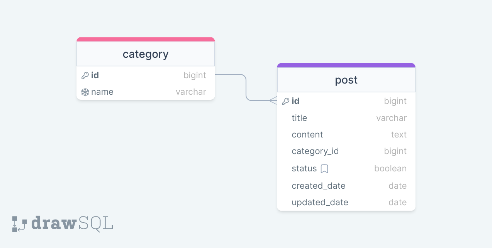

## Assignment 2

### Beklenenler
<ul>
<li>Django projenizi ve app inizi oluşturun.</li>
<li>App içerisinde diagramı verilen modelleri oluşturunuz.</li>
<li>Oluşturduğunuz modellere göre her bir model için CRUD endpointlerini hazırlayın.</li>
<li>Kullanıcı işlemleri için register/login/logout endpointlerini oluşturun.</li>
<li>End pointlere search, filter ve pagination özellikleri ekleyin.
<li>Caetgory endpointinde sadece Admin user tarafından cretae ve update yapılabilecek diğer kullanıcılar sadece read yapabilecek.</li>
<li>Post endpointinde sadece authenticated userlar cretae ve update işlemi yapabilecek diğer kullanıcılar sadece read yapabilecek.</li>
<li>Projeye ekstra olarak model ekleyebilirsiniz.</li>

</ul>

 