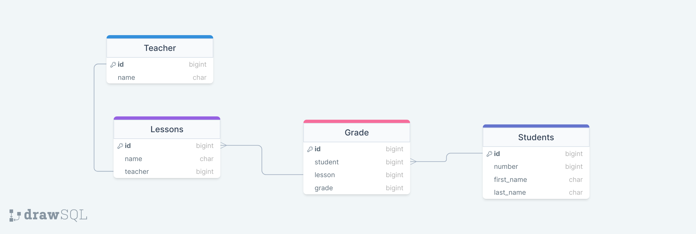

# Student Grades App

## Beklenenler
- Django Projenizi oluşturunuz ve içine bir grades appi ekleyiniz.
- App içerisinde diagramı verilen modelleri oluşturunuz.
- Oluşturduğunuz modellere göre her bir model için CRUD endpointlerini hazırlayın.
- Her bir öğretmenin bir dersi olacak.
- Her öğrencinin ilgili derse ait bir notu olacak.
- Projeye ekstra olarak model ve fieldlar ekleyebilirsiniz.