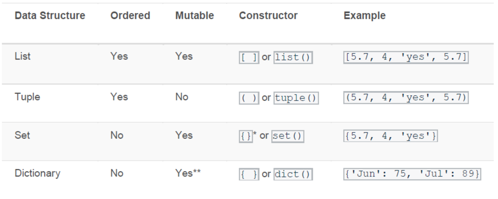

# Python Collection Types

- List
- Dictionary
- Tuple
- Set


## List

Lists are mutable sequences, typically used to store collections of items (where the precise degree of similarity will vary by application).


```py
list3 = ["Apple", 1, 3.5, True, [1, 3], {"Ready": "yes"}]
```

### creating a list:
Lists may be constructed in several ways:
- Using a pair of square brackets to denote the empty list: []
- Using the type constructor: list() or list(iterable)
```py
a = list()
print(a)
print(type(a))

name = "rafe stefano"

list1 = ["apple", "banana", "cherry"]
list2 = list(name)

new_list1 = list(list1)
new_list2 = [list1]

print(new_list1)
print(new_list2)
```

The constructor builds a list whose items are the same and in the same order as iterable’s items.

- list('abc') returns ['a', 'b', 'c'] 
- list( (1, 2, 3) ) returns [1, 2, 3]

### basic operations with list:

Python has a set of built-in methods that you can use on lists:

```py
clear()	  # Removes all the elements from the list
copy()	  # Returns a copy of the list
```

- The copy() method in Python returns a copy of the List. We can copy a list to another list using the = operator, however copying a list using = operator means that when we change the new list the copied list will also be changed, if you do not want this behaviour then use the copy() method instead of = operator. 

```py
list1 = ["a", "b", "c"]
list2 = [1, 2, 3]

count()	  # Returns the number of elements with the specified value
extend()  # Add the elements of a list (or any iterable), to the end of the current list
index()	  # Returns the index of the first element with the specified value
pop(index)	  # Removes the element at the specified position, assigning the popped item to a new variable
reverse() # Reverses the order of the list
```


How to reach a value inside a list:
```py
# Reach to the index no 1 inside inner list:
a = ['ali', 2, [1,2], 7]
a[2][1]
2
```

How to join two list:
```py
list1 = ["a", "b", "c"]
list2 = [1, 2, 3]

list3 = list1 + list2
print(list3)
# or
list1.extend(list2)
print(list1)

# ['a', 'b', 'c', 1, 2, 3]
```
(document list)[https://docs.python.org/3/library/stdtypes.html#sequence-types-list-tuple-range]
(more on list)[https://docs.python.org/3/tutorial/datastructures.html#more-on-lists]


## Dictionary
Dictionaries are used to store data values in key:value pairs.

A dictionary is a collection which is ordered, changeable and does not allow duplicates.

Dictionaries are written with curly brackets, and have keys and values:

```py
thisdict = {
  "brand": "Ford",
  "model": "Mustang",
  "year": 1964
}
print(thisdict)
# {'brand': 'Ford', 'model': 'Mustang', 'year': 1964}

# You can access the items of a dictionary by referring to its key name, inside square brackets:
x = thisdict["model"]
print(x)
# Mustang

# If there is not such a key, it will raise key error. To avoid this use get() method.


# There is also a method called get() that will give you the same result:
x = thisdict.get("model")
print(x)
# Mustang

# If not, then it will return None (if get() is used with only one argument). 
# Default None can be changed to a worning message: 
thisdict.get("bran", "There is no such a key!")


# The keys() method will return a list of all the keys in the dictionary.
x = thisdict.keys()
print(x)
# dict_keys(['brand', 'model', 'year'])
# Keys can be displayed on a loop:
for key in  thisdict.keys():
  print(key)


# Add a new item to the original dictionary, and see that the keys list gets updated as well:
thisdict["color"] = "white"


# You can change the value of a specific item by referring to its key name:
thisdict["year"] = 2022

# The update() method will update the dictionary with the items from the given argument. The argument must be a dictionary, or an iterable object with key:value pairs.
thisdict.update({"year": 2020})

# Adding an item to the dictionary is done by using a new index key and assigning a value to it:
thisdict["color"] = "red"

# The pop() method removes the item with the specified key name:
thisdict.pop("model")

# The popitem() method removes the last inserted item 
thisdict.popitem()


# The del keyword removes the item with the specified key name:
del thisdict["model"]

# The del keyword can also delete the dictionary completely.

# The clear() method empties the dictionary.
```

- Reaching list item is the same with lists

Dictionary Methods (search in google)

Python has a set of built-in methods that you can use on dictionaries.

```py
clear()	# Removes all the elements from the dictionary
get()	# Returns the value of the specified key
items()	# Returns a list containing a tuple for each key value pair
keys()	# Returns a list containing the dictionary's keys
values()	# Returns a list of all the values in the dictionary
pop()	# Removes the element with the specified key
popitem()	# Removes the last inserted key-value pair
update()	# Updates the dictionary with the specified key-value pairs

```


## Tuples
- Less memory
- Stable, unchanged values
- Faster

Tuples are immutable sequences, typically used to store collections of heterogeneous data.

Tuples may be constructed in a number of ways:
- Using a pair of parentheses to denote the empty tuple: ()
- Using a trailing comma for a singleton tuple: "a", or ("a",)
- Separating items with commas: "a", "b", "c" or ("a", "b", "c")
- Using the tuple() built-in: tuple() or tuple(iterable)

Tuple items are ordered, unchangeable, and allow duplicate values.

To create a tuple with only one item, you have to add a comma after the item

```py
thistuple = ("apple",)
print(type(thistuple))

# NOT a tuple
thistuple = ("apple")
print(type(thistuple))

# A tuple with strings, integers and boolean values:
tuple1 = ("abc", 34, True, 40, "male")

# Print the second item in the tuple:
thistuple = ("apple", "banana", "cherry")
print(thistuple[1])
```

Python has two built-in methods that you can use on tuples.
```py
count()	# Returns the number of times a specified value occurs in a tuple
index()	# Searches the tuple for a specified value and returns the position of where it was found
```

```py
# Join two tuples:
tuple1 = ("a", "b" , "c")
tuple2 = (1, 2, 3)

tuple3 = tuple1 + tuple2
print(tuple3)

# ('a', 'b', 'c', 1, 2, 3)
```


## Set

Sets are used to store multiple type of items in a single variable.
A set is a collection which is both unordered and unindexed.
Sets are written with curly brackets.
A set can contain different data types:
You cannot access items in a set by referring to an index or a key.

It is possible to use the set() constructor to make a set.

```py
# Create a Set
thisset = {"apple", "banana", "cherry"}

# Get the number of items in a set:
print(len(thisset))

# To add one item to a set use the add() method.
thisset.add("orange")

# To remove an item in a set, use the remove(), or the discard() method.
thisset.remove("banana")
thisset.discard("banana")

# If the item to remove does not exist, discard() will NOT raise an error.

# Remove the last item by using the pop() method:

# Sets are unordered, so when using the pop() method, you do not know which item that gets removed.
```

Python has a set of built-in methods that you can use on sets.

```py
add()	# Adds an element to the set
clear()	# Removes all the elements from the set
copy()	# Returns a copy of the set
difference()	# Returns a set containing the difference between two or more sets
difference_update()	# Removes the items in this set that are also included in another, specified set
discard()	# Remove the specified item
intersection()	# Returns a set, that is the intersection of two other sets
intersection_update()	# Removes the items in this set that are not present in other, specified set(s)
isdisjoint()	# Returns whether two sets have a intersection or not
issubset()	# Returns whether another set contains this set or not
issuperset()	# Returns whether this set contains another set or not
pop()	# Removes an element from the set
remove()	# Removes the specified element
symmetric_difference()	# Returns a set with the symmetric differences of two sets
symmetric_difference_update()	# inserts the symmetric differences from this set and another
union()	# Return a set containing the union of sets
update()	# Update the set with the union of this set and others
```

```py
a = {1, 2, 3, 10, 32, 100}
b = {1, 2, 32}

a.difference(b)
a.intersection(b)
a.union(b)
```

## Sets vs Lists vs Tuples and Dictionary



## Summary

- List
   - Intro
   - Creating List
      - []
      - list()
   - Basic operations with list
      - append()
      - insert()
      - remove()
      - sort()
      - len()
      - pop()
      - extend()
      - index()
      - count()
      
   - Accessing Lists
      - Indexing
      - Slicing
      - Negative Indexing & Slicing

- Dictionary
   - Intro
   - Creating Dictionary
      - {}
      - dict()

   - Basic operations with list
      - clear()
      - get()
      - items()
      - keys()
      - pop()
      - popitem()
      - update()

   - Accessing Dictionaries
      - nested dicts


- Tuples

    - Intro
    - Creating Tuples
      - ()
      - tuple()

    - Basic operations with tuple
      - accessings items with indexing
      - count()
      - index()

- Set
    - Intro
    - Creating Sets
      - {}
      - set()
    
    - Basic operations with tuple
      - add()
      - remove()
      - discard
      - pop()
      - intersection()
      - union()
      - difference()
      